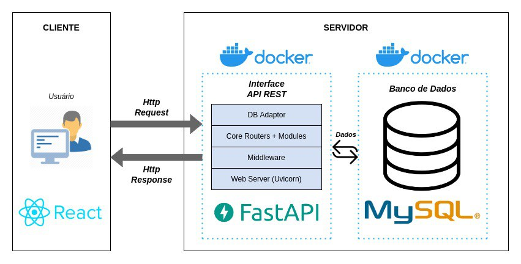
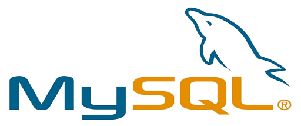
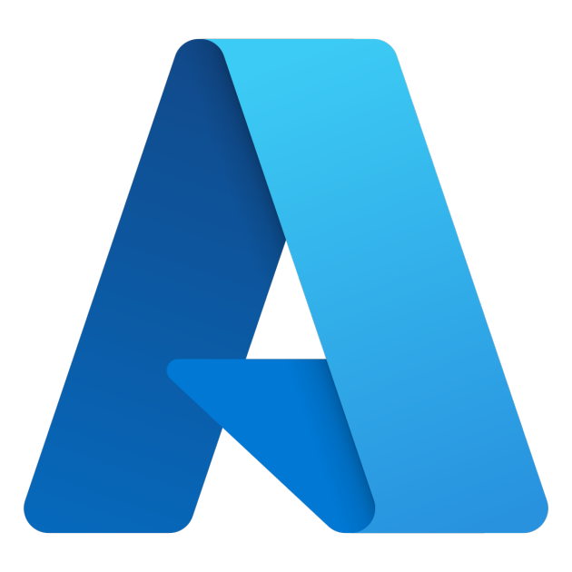
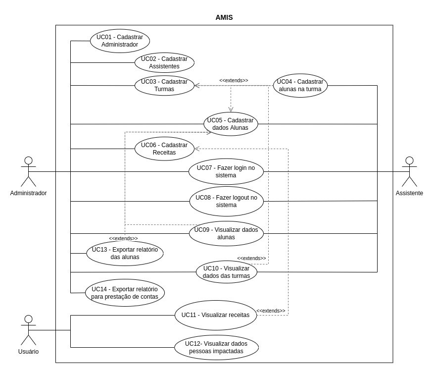
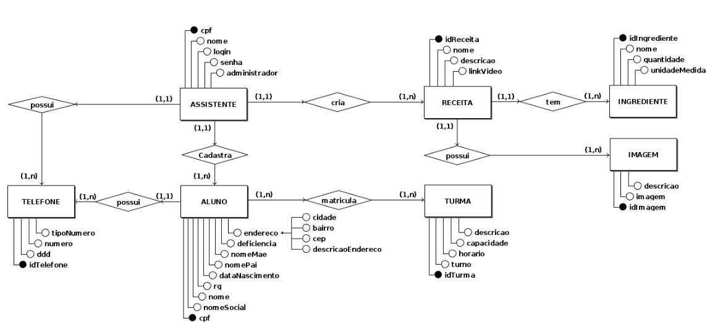
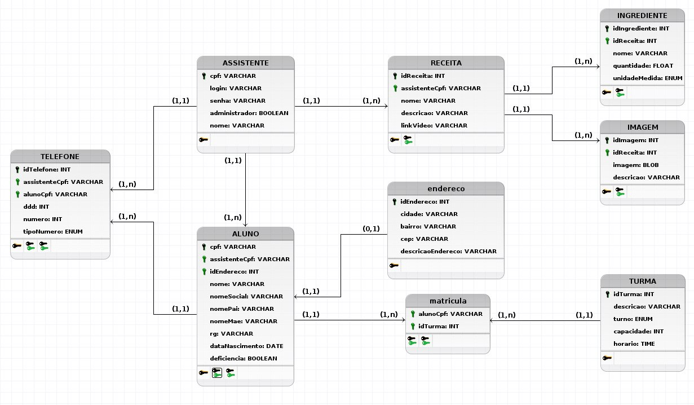

# Arquitetura

## Visão Geral da Arquitetura

Este documento visa estabelecer o escopo da arquitetura de software que será utilizada para a implementação do projeto AMIS. Serão abordados os padrões de arquitetura, assim como os frameworks e bibliotecas que farão parte do desenvolvimento do projeto. Aqui serão detalhadas as características essenciais da arquitetura adotada pela equipe desenvolvedora a partir da representação arquitetural, as restrições de arquitetura e a visão lógica dados.

## Representação da Arquitetura - Microsserviços

Para o desenvolvimento do sistema, foi escolhida a arquitetura de microsserviços ou SOA (Service Oriented Architecture). Esta é uma abordagem onde o software é construído em pequenos serviços independentes, que se comunicam através de APIs. Algumas de suas características são: desacoplamento e independência entre as partes, escalabidade, diversificação de tecnologias e definição clara de domínios.

## Representação da Arquitetura

O Back-end será composto por pacotes que representam os épicos do nosso backlog, que estão listados a seguir:

- **Cadastro:** Responsável pelo CRUD dos dados que compoem o sistema, como alunas, turmas, receitas, etc.
- **Autenticação:** Responsável por lidar com a autenticação no sistema e com a criação dos perfis de usuário dentro do sistema.
- **PDF:** Responsável pela geração dos documentos necessários para a prestação de contas.
- **Relatório:** Responsável por prover os dados para a geração de gráficos e organizar informações sobre o desempenho das alunas.

## Metas e Restrições da Arquitetura

### Metas:
- Ser funcional nos principais browsers da atualidade: Chrome, Firefox, Edge, Brave.
- Código modularizado em microsserviços, facilitando a manutenção e escalabilidade.
- Padronização no design, na comunicação e integração com o banco de dados, API, frontend e backend.
- Facilitar uma futura implementação mobile.

### Restrições:
- Necessidade de conexão à internet.
- Necessidade de conexão ao banco de dados.
- Necessidade de conexão à API.
- Necessidade de rodar em um navegador web.

## Tecnologias

| React JS | FastAPI | MySQL | Docker | Gráficos | Azure | ReportLab |
| :-: | :-: | :-: | :-: | :-: | :-: | :-: |
|  |  |  |  |  |  |  |

### **Frontend:** React (JavaScript)

No front-end, escolhemos o ReactJS. React é uma biblioteca útil na criação de interfaces de usuário e é uma das mais famosas e eficientes bibliotecas baseadas em JavaScript. Essa biblioteca possibilita a fácil criação de aplicações web/mobile dinâmicas, uma vez que requer pouco código para ter várias funcionalidades à disposição e, por consequência, tem uma curva de aprendizado pequena. Também oferta uma ótima performance graças ao Virtual DOM, que é uma ferramenta de otimização de exibição de elementos. Por meio do React, faremos, por exemplo, o uso de ferramentas para a geração de gráficos para a exibição no site.

### **Backend:** FastAPI (Python)

Para o back-end, escolhemos o FastAPI. Este framework é útil na criação de APIs e um dos frameworks mais performáticos disponível, baseado na linguagem Python. A escolha foi baseada em vários aspectos, dentre eles o os principais foram: estabilidade, confiabilidade e agilidade do framework e uma curva de aprendizado mais favorável ao grupo em relação a outros frameworks (por ter código enxuto), e a melhor utilização da arquitetura por microsserviços. Além do fato do framework ter um sistema de requisições à API embutido, o Swagger.

### **Banco de Dados:** Relacional (MySQL)

Como gerenciador de banco de dados, escolhemos o MySQL. SQL, primeiramente, é uma linguagem de comunicação com bancos de dados relacionais, que possibilita a realização de consultas, inserções, edições e exclusões de dados em tabelas estruturadas. O MySQL é um sistema de gerenciamento de bancos de dados relacionais, baseado em SQL. Escolhemos o MySQL por conta da sua ampla compatibilidade, além de sua facilidade de instalação e variedade de configurações, tem uma ótima performance e escalabilidade.

### **Ambiente:** Docker

Como ambiente de virtualização, escolhemos o Docker. Ele facilita a criação, administração e compartilhamento de ambientes isolados, permitindo o empacotamento de uma aplicação, ambiente ou sistema operacional dentro de um container, tornando-se portátil para outro host que tenha o Docker instalado. Entre suas vantagens se encontra a economia de recursos, caso comparado a máquinas virtuais. Portanto, o Docker permite uma maior portabilidade e eficiência na produção da aplicação para o time de desenvolvimento.

### **Gráficos:** Visx

Para a biblioteca de gráficos foi escolhida a Visx. A Visx é um conjunto de vários pacotes do React, o que possibilita a utilização somente dos pacotes necessários. Ela também apresenta um alto nível de customização dos gráficos que se deseja criar e é baseada em React, portanto utiliza padrões similares do resto do projeto.

### **PDFs:** ReportLab

A biblioteca ReportLab será encarregada da geração de PDFs no projeto. A ReportLab é Open Source e uma das mais rápidas e performáticas bibliotecas para a geração de PDFs, mais rápida até que soluções disponíveis para desktop nativo.

### **Hospedagem:** Azure

Para o deploy, escolhemos a plataforma cloud Azure. O Azure é uma plataforma utilizada para fazer deploy, manutenção e escalar aplicações. Além disso, a plataforma é fácil de ser usada e permite organizar as várias partes do sistema separadamente e também integrá-las.

## Visão de Casos de Uso
O diagrama de caso de uso resume os detalhes dos usuários da aplicação, que também são conhecidos como atores, e as interações deles com o sistema.

### Casos de uso
* Cadastrar administrador;
* Cadastrar Assistente;
* Cadastrar Turma;
* Cadastrar aluno na turma;
* Cadastrar dados do aluno;
* Cadastrar Receitas;
* Fazer Login;
* Fazer Logout;
* Visualizar dados de alunos;
* Visualizar dados de turmas;
* Visualizar Receitas;
* Visualizar dados de pessoas impactadas;
* Exportar relatório de alunos;
* Exportar relatório de prestação de conta.

### Atores
* Administrador: Usuário do sistema que possui todas as permissões, pode acessar a área logada e também consegue visualizar/manipular todos os dados inseridos na aplicação. Responsável por gerenciar os Assistentes/Usuários.

* Assistente: Usuário do sistema que possui algumas permissões, pode acessar determidadas funcionalidades, incluindo a área logada. Responsável por auxiliar o Administrador.

* Usuários: Possui acesso a área não logada da aplicação e pode visualizar receitas públicas previamente cadastradas pelo Administrador.

### Diagrama de caso de uso

## Visão de Dados
 À partir do banco de dados MySql, será possível armazenar os dados dos alunos(as) e das turmas, além de permitir guardar todas as receitas utilizadas para a produção dos produtos.

 A figura a seguir mostra o Modelo Conceitual (Entidade - Relacionamento) elaborado para atender as necessidades do sistema:

As entidades são:
* ASSISTENTE;
* ALUNO;
* TELEFONE;
* TURMA;
* RECEITA;
* IMAGEM; 
* INGREDIENTE.

Que, numa visão lógica, são representadas por: 

## Referências

- [The Best Guide to Know What Is React](https://www.simplilearn.com/tutorials/reactjs-tutorial/what-is-reactjs)

- [FastAPI](https://fastapi.tiangolo.com/)

- [Docker](https://docs.docker.com/get-started/overview)

- [Visx](https://airbnb.io/visx)

- [MER](https://www.inf.ufsc.br/~r.fileto/Disciplinas/INE5423-2010-1/Aulas/02-MER.pdf)

## Versionamento

| Data | Versão | Descrição | Autor(es) |
|------|--------|-----------|-----------|
| 26/11/2022 | 0.1 | Criação do documento (Visão geral, Representação e Tecnologias) | [Gabriela Pivetta](https://github.com/gabrielapivetta), [Eduardo](https://github.com/fxred), [Fabrício](https://github.com/FabricioDeQueiroz) e [Kalebe](https://github.com/KalebeLopes) |
| 26/11/2022 | 0.2 | Adição das Metas e definições das Tecnologias | [Gabriela Pivetta](https://github.com/gabrielapivetta), [Eduardo](https://github.com/fxred) e [Fabrício](https://github.com/FabricioDeQueiroz) |
| 26/11/2022 | 0.3 | Adição das Restrições e definições das Tecnologias | [Gabriela Pivetta](https://github.com/gabrielapivetta), [Eduardo](https://github.com/fxred) e [Fabrício](https://github.com/FabricioDeQueiroz) |
| 05/12/2022 | 0.4 | Alteração das definições de arquitetura | [Gabriela Pivetta](https://github.com/gabrielapivetta), [Kalebe](https://github.com/KalebeLopes) |
| 05/12/2022 | 0.5 | Adição dos diagramas | [Kalebe](https://github.com/KalebeLopes), [Gabriela Pivetta](https://github.com/gabrielapivetta) |