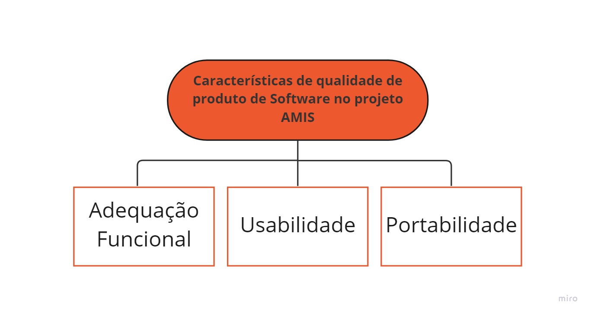
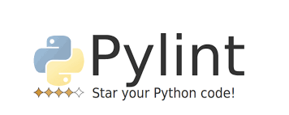
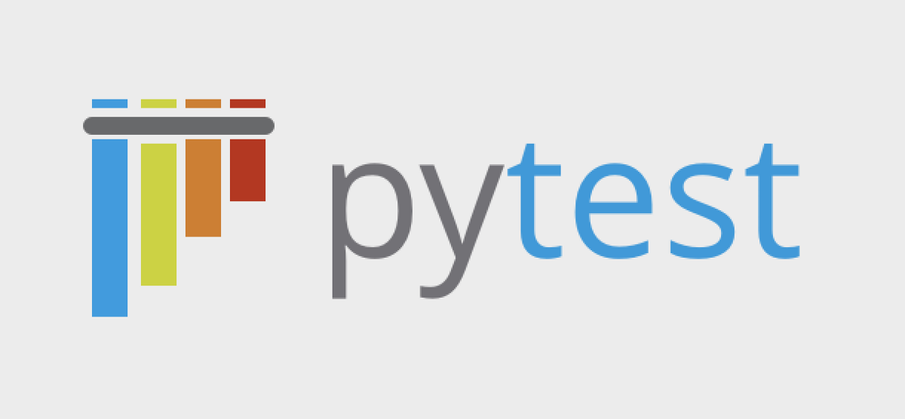

# Qualidade do Projeto

Este documento tem como objetivo mostrar os critérios, ferramentas e o planejamento da qualidade de código do projeto, esclarecendo o como, quais e porquês das adoções de cada tipo de teste durante o desenvolvimento do produto. O projeto **AMIS** ultilizando a norma NBR 13596.

A norma NBR 13596 define 8 características de qualidade que todos os software devem ter, de forma a alcançar um nível muito alto de qualidade no software que será entregue. São elas: adequação funcional, eficiência de performance, compatibilidade, usabilidade, confiabilidade, segurança, portabilidade e capacidade de manutenção. No projeto AMIS sera focado em 3 principalmente, Adequação Funcional, Usabilidade e Portabilidade mas não tirando a prioridade das outras etapas.

#### Adequação Funcional
O produto deve fornecer corretamente funções para todas as necessidades implicitas e explicitas do cliente, de maneira simples e intuitiva.
No projeto **AMIS**, as necessidades do usuário foram analisadas e especificadas durante o desenvolvimento do <a href="https://fga-eps-mds.github.io/2022.2-Amis-Doc/Visao_Produto/lean_inception/"> Lean Inception</a>, e por fim, foram listadas em forma de histórias de usuário no <a href="https://fga-eps-mds.github.io/2022.2-Amis-Doc/Backlog/backlog/">Product Backlog </a>.

#### Usabilidade
O produto deve ser feito de maneira que qualquer pessoa consiga ultilizar ou aprender a ultilizar facilmente, ter uma estética que seje agradavel ao usuário e o facilite a entender o que fazer de maneira a evitar o maximo de erros do usuário por não entender o sistema.
A interface do **AMIS** é projetada para ser fácil de operar e controlar, com navegabilidade intuitiva, para garantir que o sistema possa ser utilizado por usuários com a mais ampla gama de características e capacidades.

#### Portabilidade
Capacidade do sistema ser ultilizado em outro ambiente e funcionar adequadamente sem muitas dificuldades.
O projeto AMIS é projetado para ser um web/app, logo conseguindo funcionar em qualquer dispositivo com um navegador de internet.

### Planejamento

Com o objetivo de obter a melhor qualidade de código, no projeto **AMIS** utilizaremos os *Pylint* e *Pytest* como ferramentas de qualidade para o *back-end*, como também *Jtest* para o *front-end*. 

### Ferramentas

#### Pylint
 * Se trata de um analisador de código estático, que analisa o código *Python* sem realmente executá-lo. Ele pode verificar erros de programação, implementar práticas recomendadas em padrões de codificação, identificar violações de código, fornecer sugestões de refatoração e retornar uma variedade de relatórios sobre todo tipo de problema que ele encontra.

#### Pytest
* Também se trata de uma ferramenta que permite fazer códigos de teste usando Python. Ajuda a escrever casos de teste simples e escaláveis ​​para bancos de dados, APIs ou interface do usuário. PyTest é usado principalmente para escrever testes para APIs e ajudando a escrever testes de unidade simples até testes funcionais complexas.

* Algumas vantagens: 
Muito fácil de começar devido à sua sintaxe simples;  Pode executar testes em paralelo; Detecta testes automaticamente; Código aberto.

#### Jest
* Jest é uma ferramenta baseada em JavaScript para testar React, React Native e outros aplicativos baseados em JavaScript. Em muitos casos, os testes de unidade não fornecem resultados precisos quando executados no front-end de qualquer software. O Jest reduz esse problema permitindo que você escreva testes de front-end mais rápidos e eficazes.

* Além disso, o Jest pode ser usado para validar quase tudo em torno do JavaScript, especialmente a renderização do navegador de aplicativos da web. Com sua API intuitiva e fácil configuração e instalação, o Jest se tornou uma das estruturas de teste de JavaScript mais populares disponíveis atualmente.

### Referências
* Análise sobre a ISO 9126. **NBR 13596**.Disponível em: [tiespecialidade.com](https://www.tiespecialistas.com.br/analise-sobre-iso-9126-nbr-13596/). Acesso em 01 de Dezembro de 2022;
* Definição *Pylint*. Disponível em: [pylint.pycqa.org](https://pylint.pycqa.org/en/latest/), [ipwithease.com](https://ipwithease.com/what-is-pylint-python-programming-tool/). Acesso em 02 de Dezembro de 2022;
* Definição *Pytest*: Disponível em: [guru99.com](https://www.guru99.com/pytest-tutorial.html). Acesso em 02 de Dezembro de 2022.
* Definição *Jest*. Disponível em: [lambdatest.com](https://www.lambdatest.com/jest). Acesso em 03 de Dezembro de 2022.

## Versionamento

| Data | Versão | Descrição | Autor(es) |
|------|--------|-----------|-----------|
| 03/12/2022 | 1.0 | Criação do documento | [Italo Bruno](https://github.com/ItaloBrunoM) |
| 03/12/2022 | 1.1 | Definição das ferramentas | [Caio Sulz](https://github.com/CaioSulz) |
| 03/12/2022 | 1.2 | Caracteristicas de Qualidade | [Italo Bruno](https://github.com/ItaloBrunoM) | 