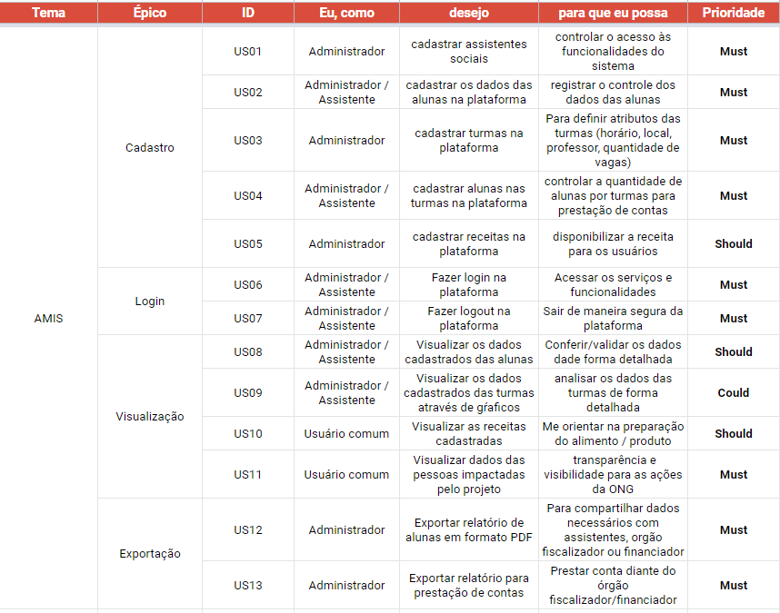

# Backlog

O projeto iniciou com o Lean Inception, um workshop colaborativo dividido em diversas etapas e atividades, por meio de reuniões e debates, utilizados para orientar a equipe na construção do produto.

Após o Lean Inception, é possível definir o Product Backlog e definir histórias de usuários a serem desenvolvidas durante o projeto.

# Product Backlog

O backlog contêm os itens ordenados que serão desenvolvidos pelo time para o produto. Esses itens de trabalho são expressos na forma de necessidades do usuário, objetivos de negócios dos clientes e demais partes interessadas ou funcionalidades do produto. O Backlog do Produto é uma origem única dos requisitos para qualquer mudança a ser feita no produto. É refinado a cada Sprint, sendo a principal entrada para a realização de cada sprint.

No contexto do produto, o Product Backlog foi divido em: Épicos e User Stories. Foram definidos 4 épicos como o MVP do projeto e 11 User Stories. O artefato pode ser visualizado a seguir.

[Link do Backlog](https://docs.google.com/spreadsheets/d/17Bi-MHd1MYtOc6bwy8qAHqQTlhrCao5arH_KqRKX1n4/edit#gid=877927985)

## Versionamento

| Data | Versão | Descrição | Autor(es) |
|------|--------|-----------|-----------|
| 20/11/2022 |  1.0 | Versão inicial do backlog do produto | [André Lucas](https://github.com/andrelucasf), [Fabrício](https://github.com/FabricioDeQueiroz), [Kalebe](https://github.com/KalebeLopes) e [João Vítor](https://github.com/Jvsoutomaior) |
| 11/12/2022 |  1.1 | Correção de erros de digitação do backlog do produto | [Paulo](https://github.com/paulohborba) e [Caio](https://github.com/CaioSulz) |
| 12/12/2022 |  1.2 | Correção de erros de digitação do backlog do produto | [Paulo](https://github.com/paulohborba) e [Caio](https://github.com/CaioSulz) |
