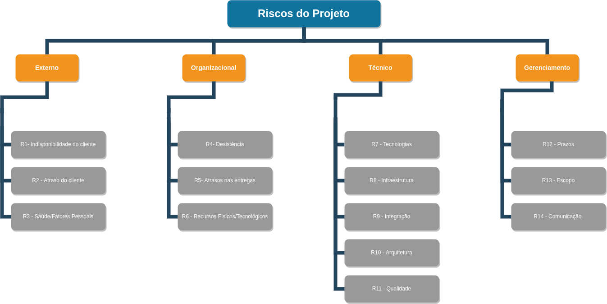

# Risco
## Introdução
O objetivo deste documento é identificar as principais categorias de riscos do projeto, suas consequências e também as medidas necessárias para reduzir ao máximo suas ocorrências.

## Estrutura Analítica de Riscos
A Estrutura Analítica de Riscos é uma representação hierárquica dos riscos, de acordo com suas subcategorias.

## Descrição dos Riscos da Estrutura analítica de Riscos
### Riscos Externos
| Id | Risco | Consequência | Contigência | 
|------|--------|-----------|-----------|
|   R1  |  Indisponibilidade do cliente para validar os artefatos  |  Dificuldade em seguir com a criação dos documentos do projeto e possibilidade de refazer documentos feitos sem a validação |  Adequar as datas das reuniões de acordo com a disponibilidade do cliente  |
|   R2  |  Atraso do cliente em repassar informações  |  Dificuldade em seguir com o desenvolvimento do sistema e possibilidade de refazer códigos feitos sem a validação  |  Adequar as datas das reuniões de acordo com a disponibilidade do cliente  |
|   R3  |  Saúde/Fatores Pessoais  |  Atraso nas entregas, falta nas reuniões e, consequentemente, desatualização do andamento do projeto  |  Deixar toda a equipe ciente de todas as atividades que estão sendo realizadas por cada sub-equipe  |

### Riscos Organizacionais
| Id | Risco | Consequência | Contigência | 
|------|--------|-----------|-----------|
|   R4  |  Desistência de Membros  |  Sobrecarga da equipe e diminuição do volume de entrega  |  Manter os membros engajados  |
|   R5  |  Atrasos nas entregas  |  Insatisfação do cliente em não receber o produto proposto  |  Realizar um bom planejamento do projeto  |
|   R6  |  Falta de Recursos Físicos/Tecnológicos  |  Atraso nas entregas por falta/problemas nos computadores, internet, ambiente de homologação, ambiente de produção  |  Obter recursos financeiros para cobrir as despesas obrigatórias  |

### Riscos Técnicos
| Id | Risco | Consequência | Contigência | 
|------|--------|-----------|-----------|
|   R7  |  Conhecimento das Tecnologias  |  Dificuldade em codificar as atividades designadas  |  Realizar treinamentos das tecnologias com toda a equipe  |
|   R8  |  Infraestrutura  |  Dificuldade de configurar a integração contínua e em fazer deploy das versões da aplicação   |  Realizar treinamentos sobre a plataforma de hospedagem da aplicação  |
|   R9  |  Integração das partes do Software  |  Possíveis erros na integração do front-end, back-end e banco de dados  |  Manter as partes em constante comunicação, adotar protocolos de desenvolvimento e ter uma boa documentação do projeto  |
|   R10  |  Arquitetura mal definida  |  Problemas com a escalabilidade da aplicação  |  Pesquisar e definir a melhor arquitetura que atenda ao projeto  |
|   R11  |  Baixa Qualidade de Código  |  Baixa cobertura de testes, códigos mal escritos e muito acoplados devido ao curto prazo de desenvolvimento  |  Definir bem os prazos para o desenvolvimento de cada feature e também de seus testes  |

### Riscos de Gerenciamento
| Id | Risco | Consequência | Contigência | 
|------|--------|-----------|-----------|
|   R12  |  Definição de Prazos  |  Erros nas definições de prazos impactam diretamente nas entregas  |  Estimar, juntamente com toda a equipe, o tempo x esforço necessário para a conclusão de cada atividade |
|   R13  |  Mudança de escopo  |  Acarreta em um retrabalho não planejado que pode resultar em um atraso nas entregas  |  Definir bem o escopo do projeto juntamente ao cliente  |
|   R14  |  Falta de Comunicação  |  Resulta em uma falta de orientação dos membros da equipe em relação ao projeto |  Realizar reuniões constantes para informar o andamento das atividades e documentar as decisões do projeto  |

## Visualização de Riscos

### Classificação dos Riscos

A classificação dos riscos é definida a partir de uma pontuação que leva em consideração a multiplicação do impacto de tal risco acontecer, pelo impacto que ele causa ao projeto. Considerando valores de 1 a 5, a classificação de risco é definida da seguinte forma: 

<iframe src="https://docs.google.com/spreadsheets/d/e/2PACX-1vTlARRKofTOnb_tfq_ncaMg2NLhdKnL4X1uNlX-nNLQJrgDPK1VCsKq7IDl5_IEebpv-N3RfshPGpmS/pubhtml?gid=1708200459&amp;single=true&amp;widget=true&amp;headers=false"; height=190px; width=700px></iframe>

[Link](https://docs.google.com/spreadsheets/d/1JbEsUp3hr2t1pKmjFd_9JJDle22Auj4BdXFq1jWK4fI/edit#gid=1708200459)

### Quadro de Riscos

Abaixo segue o quadro de riscos, onde é realizado uma estimativa da probabilidade e impacto de cada risco listado no projeto:

<iframe src="https://docs.google.com/spreadsheets/d/e/2PACX-1vTlARRKofTOnb_tfq_ncaMg2NLhdKnL4X1uNlX-nNLQJrgDPK1VCsKq7IDl5_IEebpv-N3RfshPGpmS/pubhtml?gid=0&amp;single=true&amp;widget=true&amp;headers=false"; height=410px; width=700px></iframe>

[Link](https://docs.google.com/spreadsheets/d/1JbEsUp3hr2t1pKmjFd_9JJDle22Auj4BdXFq1jWK4fI/edit#gid=0)
## Versionamento

| Data | Versão | Descrição | Autor(es) |
|------|--------|-----------|-----------|
|  10/12/2022   |  0.1  | Criação do documento de riscos e definição dos riscos | [Kalebe Lopes](https://github.com/KalebeLopes), [Gabriela Pivetta](https://github.com/gabrielapivetta), [Fabricio de Queiroz](https://github.com/FabricioDeQueiroz) |
|  11/12/2022   |  0.2  | Adição da introdução e do diagrama do EAR | [Kalebe Lopes](https://github.com/KalebeLopes), [Gabriela Pivetta](https://github.com/gabrielapivetta), [Fabricio de Queiroz](https://github.com/FabricioDeQueiroz) |
|  12/12/2022   |  1.0  | Adição das tabelas de visualização de riscos | [Kalebe Lopes](https://github.com/KalebeLopes), [Gabriela Pivetta](https://github.com/gabrielapivetta), [Eduardo Ferreira](https://github.com/fxred), [Fabricio de Queiroz](https://github.com/FabricioDeQueiroz) | 