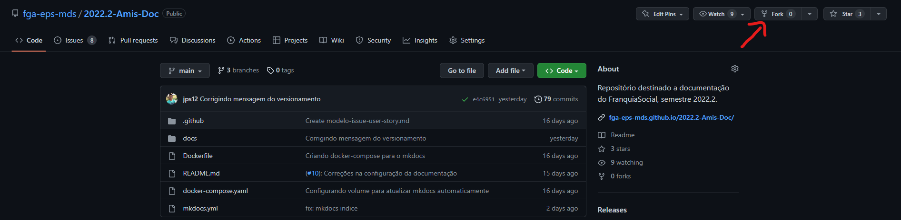
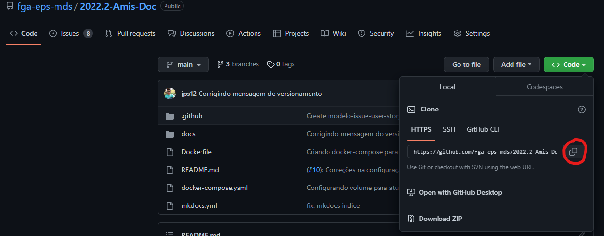
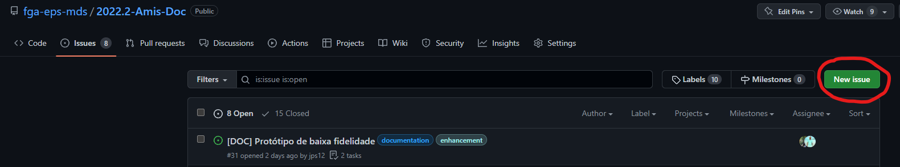

# Guia de Contribuição

O Guia de Contribuição é um documento que visa ensinar como participar deste projeto *Open Source*. 

## Começando

*  *Fork* o projeto no GitHub.
    [Tutorial para realizar o *Fork*](https://help.github.com/en/articles/fork-a-repo/).

    

*  Clone do projeto.
    [Tutorial de como clonar um repositório](https://help.github.com/en/articles/cloning-a-repository)

    

* Criar uma issue no repositório original, seguindo o template estabelecido com descrição,   critérios de aceitação, tag e os responsáveis.



*  Criar uma branch com o numero_issue-nome_issue  

    ```git
    git checkout -b 12-bug_fixed
    ```


*  Utilize um editor de texto/IDE de sua preferência para realizar a sua contribuição.

    
*  Adicionando suas modificações no Git, [Como commitar e fazer um push](http://readwrite.com/2013/10/02/github-for-beginners-part-2/).

    Adicionando uma única modificação ao commit:

    ```shell
    git add caminho/arquivo.txt
    ```

    Você pode adicionar todos os arquivos usando:

    ```shell
    git add .
    ```

    **Note:** usando o  `git add .`  irá automaticamente adicionar todos os arquivos. Vocẽ pode fazer um 
    `git status` para ver quais arquivos foram modificados.

*   O Commit deve ser (#numero_issue): descrição.  

    ```shell
    git commit -m "(#12): Correção de um bug"
    ```

*  Realize o push para a branch em que está sendo desenvolvida essa issue:

    ```shell
    git push origin branch-nome
    ```

*  Submeta um pull request:

  Após a conclusão da issue, realize um pull request para a branch dev do repositório original, colocando comentários e se possível prints das mudanças realizadas. Por fim, fecha-se a issue relacionada a este pull request.


## Versionamento

| Data | Versão | Descrição | Autor(es) |
|------|------|------|------|
|23/11/2022|1.0|Elaboração do Guia de Contribuição|[Thiago Luiz](https://github.com/thiagolsg), [Caio Sulz](https://github.com/CaioSulz)|
