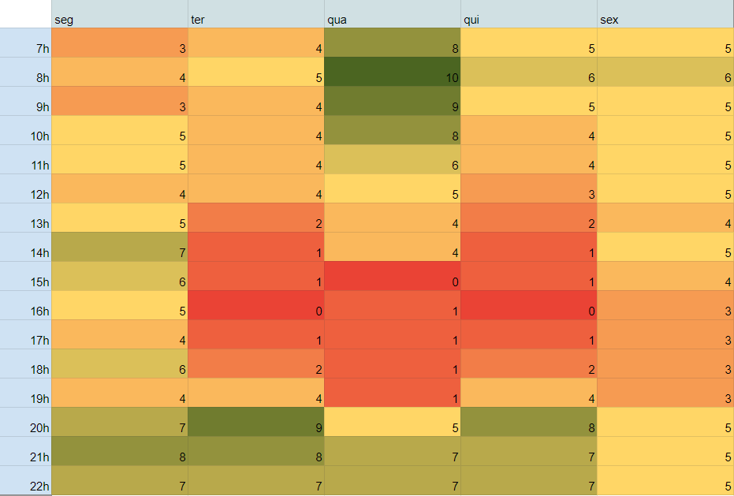

#	Plano de Comunicação

##	Introdução

###	Quadro de Disponibilidade

[Link para a planilha](https://docs.google.com/spreadsheets/d/1CI98JZXCWqoH4d-ycIWcolLLr6fknudG5CTV184qsi0/edit?usp=sharing)

### Ferramentas de comunicação

| Ferramenta | Descrição |
| ---------- | --------- |
| Discord    | Comunicação rápida com o cliente,reuniões do time, pareamento |
| Telegram   | Comunicação entre o time |
| Teams      | Reuniões com o cliente |
| GitHub     | Repositório central para documentação e versionamento de código do projeto |
| ZenHub     | Criação de issues e acompanhamento da evolução do projeto |

###	Reuniões recorrentes

- Reunião com o cliente: quarta-feira às 8h30.
- Sprint Planning/Review: segunda-feira às 21h.
- Dailys: terça e quinta 15h50 e sexta-feira às 9h.
## Versionamento

| Data | Versão | Descrição | Autor(es) |
|------|------|------|------|
|16/11/2022|1.0| Criação do documento |[Thiago Luiz](https://github.com/thiagolsg), [Paulo Borba](https://github.com/paulohborba)