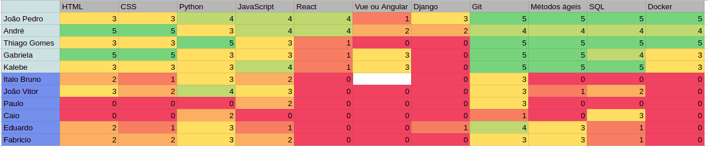

# Quadros de Conhecimentos

## Introdução

O quadro de conhecimentos serve para auxiliar a equipe na escolha das tecnologias a serem utilizadas no desenvolvimento do projeto. É uma maneira de realizar o rastreamento do nível de conhecimento técnico dos integrantes em diversos aspectos. Assim, é possível analisar a evolução das habilidades dos integrantes ao longo do desenvolvimento do sistema, com base no que será explorado no projeto.

##	Quadros de Conhecimentos

Os quadros foram separados em azul claro (alunos de EPS) e azul escuro (alunos de MDS).

### Sprint 0

## Versionamento

| Data | Versão | Descrição | Autor(es) |
|------|--------|-----------|-----------|
| 08/11/2022 | 0.1 | Criação do documento | [Gabriela Pivetta](https://github.com/gabrielapivetta) |