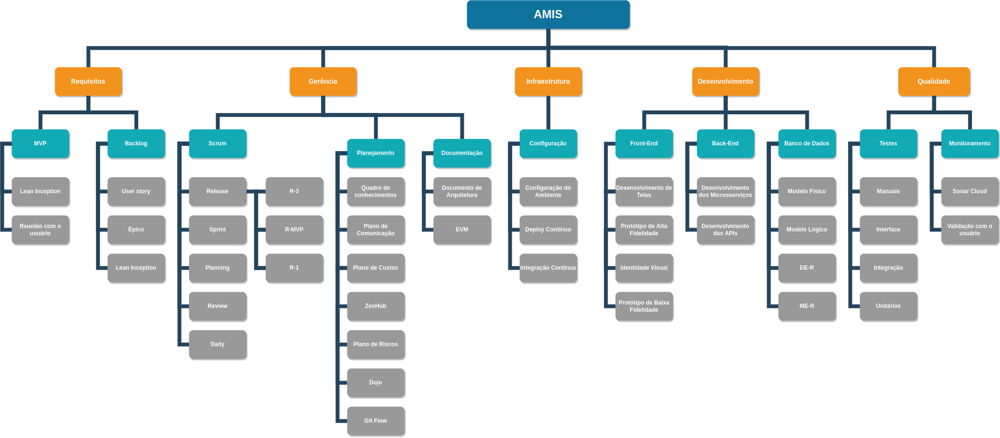

# EAP

## Introdução
EAP (Estrutura Analítica do Projeto) é um diagrama que organiza o escopo do projeto de forma visual, hierárquica e em seções menores para facilitar o gerenciamento da entrega. Ou seja, é uma ferramenta que organiza o trabalho que será executado em um projeto, simplificando graficamente o seu escopo. A estrutura analítica do trabalho também dilui as tarefas e as apresenta melhor. A natureza gráfica da estrutura ajuda os gerentes de projeto a planejar a partir de uma visão geral, garantindo uma melhor tomada de decisão.

## EAP

## Referências
* [Guia EAP - ENAP](https://repositorio.enap.gov.br/bitstream/1/1107/1/GerenciaDeProjeos_modulo_5_final_.pdf)
* [O que é EAP](https://artia.com/blog/como-fazer-eap-na-gestao-de-projetos/#:~:text=A%20EAP%20(Estrutura%20Anal%C3%ADtica%20do,facilitar%20o%20gerenciamento%20das%20entregas))

## Versionamento

| Data | Versão | Descrição | Autor(es) |
|------|--------|-----------|-----------|
|  27/11/2022   | 0.1 | Criação do documento | [Kalebe Lopes](https://github.com/KalebeLopes), [Gabriela Pivetta](https://github.com/gabrielapivetta), [João Vitor](https://github.com/Jvsoutomaior) |
