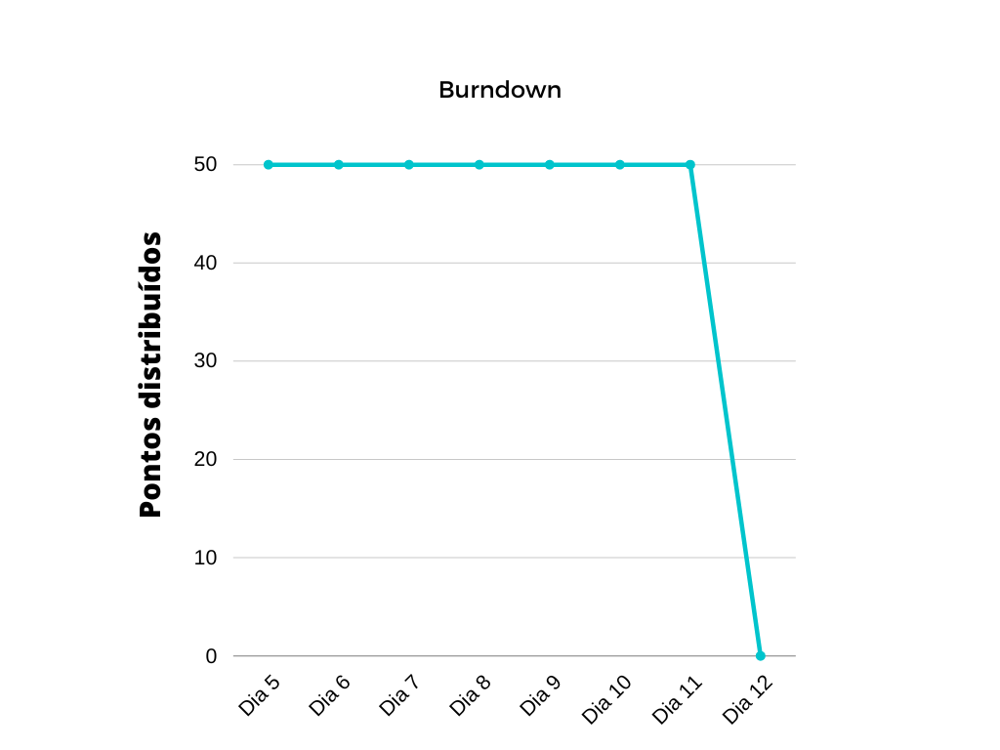
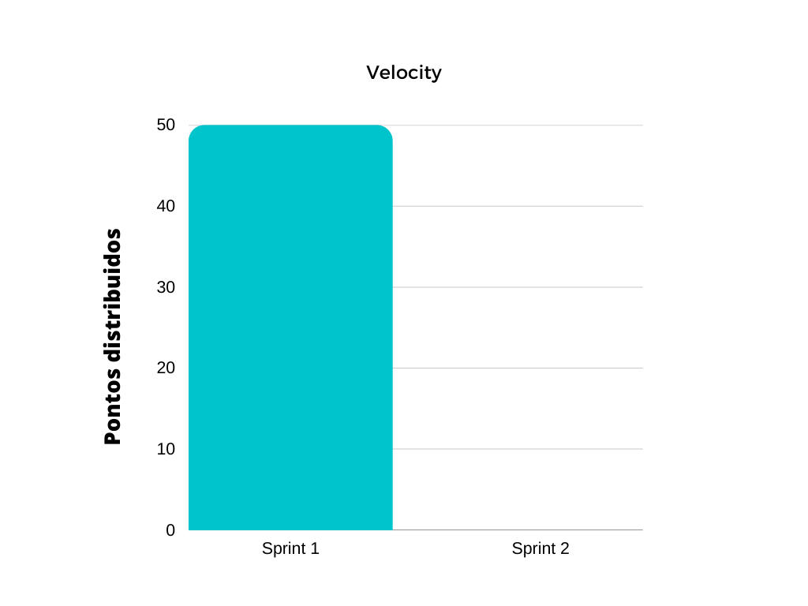

# Sprint 1

# Objetivo

- Criação do documento de Risco do projeto.
- Criação do RoadMap do projeto.
- Finalização do protótipo de alta fidelidade.
- Produção do Frontend e Backend do projeto para a primeira release.

# Planejamento

**Inicio:** 04/12/2022 
**Fim:** 11/12/2022

#### Tabela Issue 

| Número da Issue | Issue | Repositório | Pontuação | Responsáveis | 
| ---- | ---- | ---- | ---- | ---- |
| [#21](https://github.com/fga-eps-mds/2022.2-Amis-Doc/issues/21) | Configurar SonarQube Backend | Amis-Service | 8 | [André Lucas](https://github.com/andrelucasf),  [João Pedro](https://github.com/jps12) e [Thiago Luiz](https://github.com/thiagolsg) |
| [#31](https://github.com/fga-eps-mds/2022.2-Amis-Doc/issues/31) | Protótipo de alta fidelidade | Amis-DOC | 5 | [André Lucas](https://github.com/andrelucasf),  [João Vítor](https://github.com/Jvsoutomaior) e [Paulo Borba](https://github.com/paulohborba) |
| [#49](https://github.com/fga-eps-mds/2022.2-Amis-Doc/issues/49) | RoadMap | Amis-DOC | 5 | [João Pedro](https://github.com/jps12),  [Paulo Borba](https://github.com/paulohborba) e [Caio Sulz](https://github.com/CaioSulz) |
| [#50](https://github.com/fga-eps-mds/2022.2-Amis-Doc/issues/50) | Documento de Risco | Amis-DOC | 5 | [Kalebe Lopes](https://github.com/KalebeLopes),  [Gabriela Pivetta](https://github.com/gabrielapivetta), [Fabrício de Queiroz](https://github.com/FabricioDeQueiroz) e [Eduardo F. Aquino](https://github.com/fxred)|
| [#52](https://github.com/fga-eps-mds/2022.2-Amis-Doc/issues/52) | Tela Cadastro de Alunas | Amis-Front  | 8 | [André Lucas](https://github.com/andrelucasf),  [João Vítor](https://github.com/Jvsoutomaior),  e [Caio Sulz](https://github.com/CaioSulz) |
| [#53](https://github.com/fga-eps-mds/2022.2-Amis-Doc/issues/53) | Endpoints Cadastro de Alunas | Amis-Service | 8 | [Kalebe Lopes](https://github.com/KalebeLopes),  [Italo Bruno](https://github.com/ItaloBrunoM), [Thiago Luiz](https://github.com/thiagolsg) e [Eduardo F. Aquino](https://github.com/fxred) |
| [#54](https://github.com/fga-eps-mds/2022.2-Amis-Doc/issues/54) | Criação da Tela Inicial | Amis-Front | 5 | [Gabriela Pivetta](https://github.com/gabrielapivetta),  [Paulo Borba](https://github.com/paulohborba) e [Fabrício de Queiroz](https://github.com/FabricioDeQueiroz) |
| [#55](https://github.com/fga-eps-mds/2022.2-Amis-Doc/issues/55) | Configurar SonarQube para o frontend | Amis-Front | 8 | [André Lucas](https://github.com/andrelucasf),  [João Pedro](https://github.com/jps12) e [Thiago Luiz](https://github.com/thiagolsg) |
| [#56](https://github.com/fga-eps-mds/2022.2-Amis-Doc/issues/56) | Documentar Sprint 1 | Amis-DOC | 3 | [Italo Bruno](https://github.com/ItaloBrunoM) e  [João Vítor](https://github.com/Jvsoutomaior) |

#### Tabela Equipe 

| Nome | Issues Participando | Pontuação Total |
| ---- | ---- | ---- |
| [André Lucas](https://github.com/andrelucasf) | Configurar SonarQube Backend, Protótipo de alta fidelidade, Tela Cadastro de Alunas, Configurar SonarQube para o frontend | 29 |
| [Gabriela Pivetta](https://github.com/gabrielapivetta) | Documento de Risco, Criação da Tela Inicial | 10 |
| [João Pedro](https://github.com/jps12) | Configurar SonarQube Backend, RoadMap , Configurar SonarQube para o frontend | 21 |
| [Kalebe Lopes](https://github.com/KalebeLopes) | Documento de Risco, Endpoints Cadastro de Alunas  | 13 |
| [Thiago Luiz](https://github.com/thiagolsg) | Configurar SonarQube Backend, Endpoints Cadastro de Alunas, Configurar SonarQube para o frontend | 24 |
| [Caio Sulz](https://github.com/CaioSulz) | RoadMap, Tela Cadastro de Alunas | 13 |
| [Eduardo F. Aquino](https://github.com/fxred) | Documento de Risco, Endpoints Cadastro de Alunas | 13|
| [Fabrício de Queiroz](https://github.com/FabricioDeQueiroz)  | Documento de Risco, Criação da Tela Inicial | 10 |
| [Italo Bruno](https://github.com/ItaloBrunoM) | Endpoints Cadastro de Alunas, Documentar Sprint 1 | 10 |
| [João Vítor](https://github.com/Jvsoutomaior) | Protótipo de alta fidelidade, Tela Cadastro de Alunas, Documentar Sprint 1 | 16 |
| [Paulo Borba](https://github.com/paulohborba) | Protótipo de alta fidelidade, RoadMap, Criação da Tela Inicial |15 |

# Review
#### Gráficos Burndown e velocity

#### Tabela Situação final 

| Número da issue | Pull Requests | Situação ao final da Sprint | Responsáveis |
| ---- | ---- | ---- | ---- |
|[#21](https://github.com/fga-eps-mds/2022.2-Amis-Doc/issues/21)|Sem pull request associado| Concluida |[André Lucas](https://github.com/andrelucasf),  [João Pedro](https://github.com/jps12) e [Thiago Luiz](https://github.com/thiagolsg)|
|[#31](https://github.com/fga-eps-mds/2022.2-Amis-Doc/issues/31)|[#79](https://github.com/fga-eps-mds/2022.2-Amis-Doc/pull/79)| Concluida |[André Lucas](https://github.com/andrelucasf),  [João Vítor](https://github.com/Jvsoutomaior) e [Paulo Borba](https://github.com/paulohborba)|
|[#49](https://github.com/fga-eps-mds/2022.2-Amis-Doc/issues/49)|Sem pull request associado| Concluida |[João Pedro](https://github.com/jps12),  [Paulo Borba](https://github.com/paulohborba) e [Caio Sulz](https://github.com/CaioSulz) |
|[#50](https://github.com/fga-eps-mds/2022.2-Amis-Doc/issues/50)|[#78](https://github.com/fga-eps-mds/2022.2-Amis-Doc/pull/78)| Concluida|[Kalebe Lopes](https://github.com/KalebeLopes),  [Gabriela Pivetta](https://github.com/gabrielapivetta), [Fabrício de Queiroz](https://github.com/FabricioDeQueiroz) e [Eduardo F. Aquino](https://github.com/fxred)|
|[#52](https://github.com/fga-eps-mds/2022.2-Amis-Doc/issues/52)|[#5](https://github.com/fga-eps-mds/2022.2-Amis-Front/pull/5)| Concluida |[André Lucas](https://github.com/andrelucasf),  [João Vítor](https://github.com/Jvsoutomaior),  e [Caio Sulz](https://github.com/CaioSulz)|
|[#53](https://github.com/fga-eps-mds/2022.2-Amis-Doc/issues/53)|[#5](https://github.com/fga-eps-mds/2022.2-Amis-Service/pull/7)| Concluida |[Kalebe Lopes](https://github.com/KalebeLopes),  [Italo Bruno](https://github.com/ItaloBrunoM), [Thiago Luiz](https://github.com/thiagolsg) e [Eduardo F. Aquino](https://github.com/fxred)|
|[#54](https://github.com/fga-eps-mds/2022.2-Amis-Doc/issues/54)|[#4](https://github.com/fga-eps-mds/2022.2-Amis-Front/pull/4)| Concluida |[Gabriela Pivetta](https://github.com/gabrielapivetta),  [Paulo Borba](https://github.com/paulohborba) e [Fabrício de Queiroz](https://github.com/FabricioDeQueiroz)|
|[#55](https://github.com/fga-eps-mds/2022.2-Amis-Doc/issues/55)|Sem pull request associado| Concluida |[André Lucas](https://github.com/andrelucasf),  [João Pedro](https://github.com/jps12) e [Thiago Luiz](https://github.com/thiagolsg)|
|[#56](https://github.com/fga-eps-mds/2022.2-Amis-Doc/issues/56)|[#80](https://github.com/fga-eps-mds/2022.2-Amis-Front/pull/80)||[Italo Bruno](https://github.com/ItaloBrunoM) e  [João Vítor](https://github.com/Jvsoutomaior) |

## Versionamento

| Data | Versão | Descrição | Autor(es) |
|------|--------|-----------|-----------|
| 11/12/2022 | 1.0 | Criação do documento e Objetivo | [Italo Bruno](https://github.com/ItaloBrunoM) |
| 11/12/2022 | 1.1| Adição tabela de issue e tabela da equipe | [João Vítor](https://github.com/Jvsoutomaior) |
| 11/12/2022 | 1.2 | Adição tabela da situação final e imagens do burndown e velocity | [Italo Bruno](https://github.com/ItaloBrunoM) |
| 12/12/2022 | 1.3 | Adição dos pull request | [Italo Bruno](https://github.com/ItaloBrunoM) |
| 12/12/2022 | 1.4 | Atualozação dos Gráficos de velocity e burndown | [Italo Bruno](https://github.com/ItaloBrunoM) |
| 12/12/2022 | 1.5 | Adição de issues que faltaram, correção nos pontos totais | [João Vítor](https://github.com/Jvsoutomaior) |
