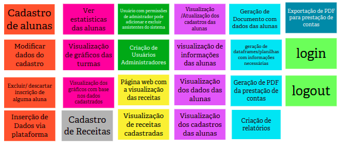

# Brainstorming de Funcionalidades

Uma funcionalidade representa uma ação ou interação de um usuário com o produto. Nesta atividade, o objetivo foi fazer um brainstorming de funcionalidades com base nas Personas e tarefas descritas nas Jornadas dos Usuários (atividades anteriores).

Contudo, na atividade a seguir (Revisão Técnica, de Negócio e de UX) foram feitas alterações em algumas funcionalidades para se encaixarem melhor no desenvolvimento real do sistema e serem melhor representadas.

## Versionamento

| Data | Versão | Descrição | Autor(es) |
|------|--------|-----------|-----------|
| 20/11/2022 | 0.1 | Criação do documento | [Gabriela Pivetta](https://github.com/gabrielapivetta) e [Italo Bruno](https://github.com/ItaloBrunoM) |