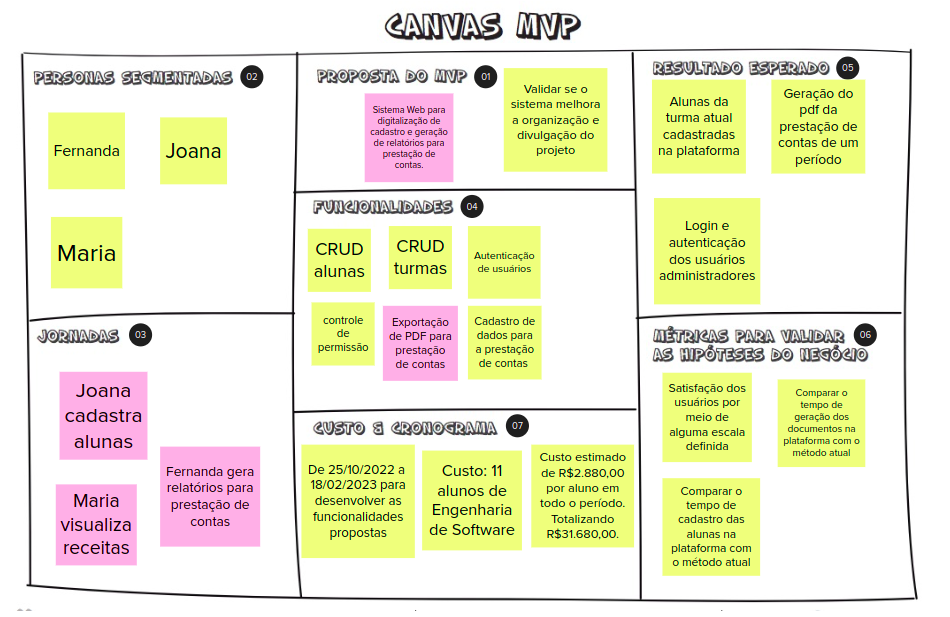

# Canvas MVP

O Canvas MVP é um quadro visual que auxilia a equipe a alinhar e definir a estratégia do MVP, ou seja, a versão mais simples do produto que pode ser disponibilizada para o negócio (produto mínimo) e que possa ser efetivamente utilizado e validado pelo usuário final (produto viável).

Todos os artefatos desenvolvidos nas atividades anteriores que entram no escopo do MVP foram reunidas no quadro mostrado abaixo. Além disso, foram definidos o tempo e custo de desenvolvimento do MVP, os resultados que são esperados e as métricas que serão utilizadas para mensurar os resultados.

## Versionamento

| Data | Versão | Descrição | Autor(es) |
|------|--------|-----------|-----------|
| 20/11/2022 | 0.1 | Criação do documento | [Gabriela Pivetta](https://github.com/gabrielapivetta) |