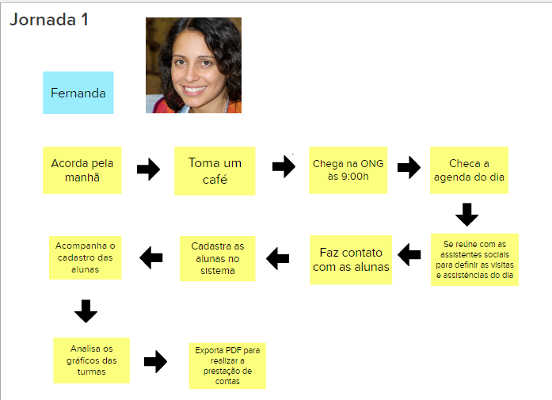
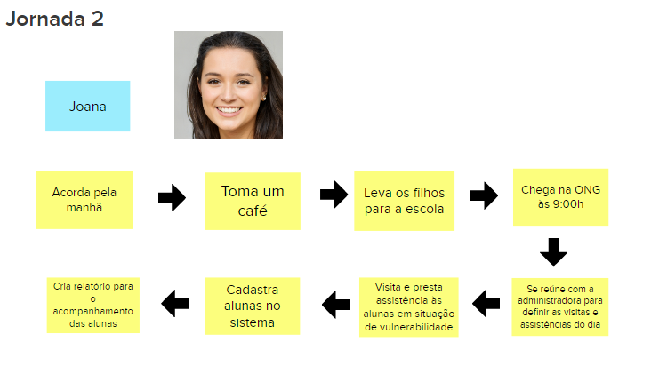
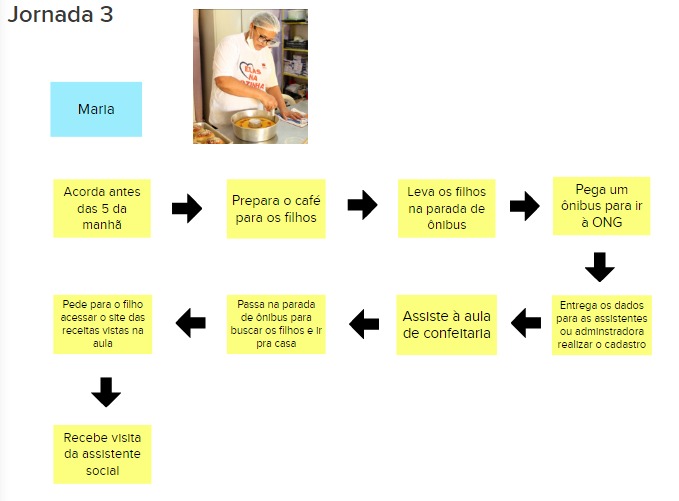

# Jornada de Usuários
A jornada descreve o percurso de um usuário por uma sequência de passos para alcançar um objetivo. Alguns destes passos representam diferentes pontos de contato com o produto, caracterizando a interação da pessoa com ele. Para a realização dessa atividade a equipe foi separada em 3 grupos de forma que cada um fizesse uma jornada para cada tipo de usuário de maneira que responda a pergunta **"Qual o objetivo a persona quer alcançar?"**, ao final foi feita uma apresentação de cada jornada para a equipe.

Foram criadas 1 jornada para cada persona conforme as imagens a seguir:

[Jornada 1: Fernanda realiza prestação de contas](../assets/jornada_1.png)   

[Jornada 2: Joana faz o gerenciamento das turmas](../assets/jornada_2.png)    

[Jornada 3: Maria assiste às aulas e acessa as receitas vistas](../assets/jornada_3.png)    

## Versionamento

| Data | Versão | Descrição | Autor(es) |
|------|--------|-----------|-----------|
| 20/11/2022 | 0.1 | Criação do documento | [Italo Bruno](https://github.com/ItaloBrunoM) |