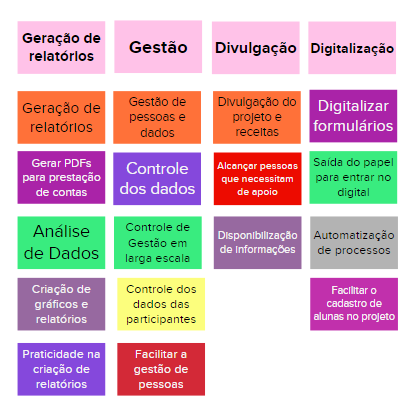

# Objetivos do Produto

Nesta atividade cada membro da equipe compartilha o que entende como os objetivos do produto, para que sejam discutidos os vários pontos de vista até que se chegue à um consenso. Cada membro escreve três respostas para a pergunta **"Se você tiver que resumir o produto em três objetivos para o negócio, quais seriam eles?"**. As respostas de todos são discutidas em grupo para que sejam esclarecidas, e então, agrupadas por em clusters similaridade. Esta atividade serve para auxiliar no levantamento e esclarecimento dos objetivos de acordo com os objetivos gerais do negócio.

## Versionamento

| Data | Versão | Descrição | Autor(es) |
|------|--------|-----------|-----------|
| 20/11/2022 | 0.1 | Criação do documento | [Gabriela Pivetta](https://github.com/gabrielapivetta) e [Italo Bruno](https://github.com/ItaloBrunoM) |
| 20/11/2022 | 0.2 | Correções no texto e formatação | [Gabriela Pivetta](https://github.com/gabrielapivetta) |
| 20/11/2022 | 0.2.1 | Correções no texto | [Italo Bruno](https://github.com/ItaloBrunoM) |