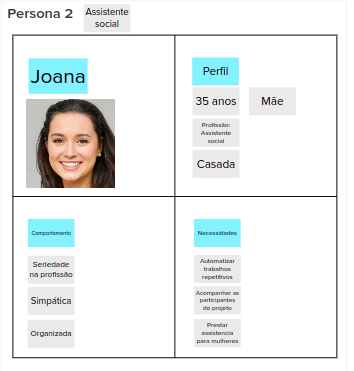

# Personas

A criação de personas serve para representar os usuário do sistema, descrevendo os seus papéis, perfil e necessidades. Assim, é possível identificar as funcionalidades do sistema, trazendo as necessidades de cada persona para auxiliar o time a descrever funcionalidades do ponto de vista de quem irá interagir com o produto final.

Para realizar esta atividade, a equipe foi novamente dividida em três grupos, um para cada persona. Ao final, todos da equipe revisaram todas as personas, em conjunto.

Foram criadas 3 personas para este produto, conforme mostram as imagens a seguir:

### **Persona 1:** Fernanda

**Representa:**
- Administrador do sistema

### **Persona 2:** Joana

**Representa:**
- Assistente Social

### **Persona 3:** Maria

**Representa:**
- Usuário comum
- Aluna

## Versionamento

| Data | Versão | Descrição | Autor(es) |
|------|--------|-----------|-----------|
| 20/11/2022 | 0.1 | Criação do documento | [Gabriela Pivetta](https://github.com/gabrielapivetta) e [Italo Bruno](https://github.com/ItaloBrunoM) |