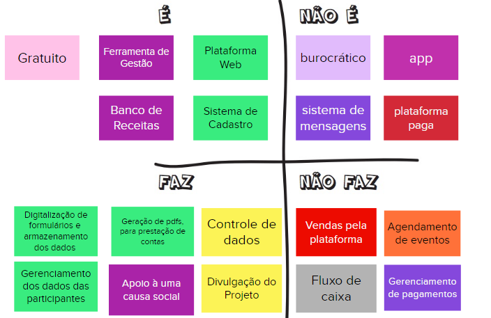

# Produto "É/Não é" e "Faz/Não Faz"

Muitas vezes é mais fácil descrever o que alguma coisa não é ou não faz, ao invés de descrever o que alguma coisa é ou faz. Essa atividade busca classificações sobre o produto seguindo as quatro diretrizes (é, não é, faz, não faz), indagando, especificamente, cada aspecto positivo e negativo sobre o produto ser ou fazer algo.

Para executar a atividade a equipe foi separada em dois grupos, um elaborou a parte *"É/Não É"* e o outro elaborou a parte *"Faz/Não Faz"*. Ao final, foi debatido o levantamento entre os dois grupos e selecionadas as características acordadas entre todos, gerando o seguinte esquema:

## Versionamento

| Data | Versão | Descrição | Autor(es) |
|------|--------|-----------|-----------|
| 19/11/2022 | 0.1 | Criação do documento | [Gabriela Pivetta](https://github.com/gabrielapivetta) e [Italo Bruno](https://github.com/ItaloBrunoM) |
| 20/11/2022 | 0.2 | Correções no texto e formatação | [Gabriela Pivetta](https://github.com/gabrielapivetta) |