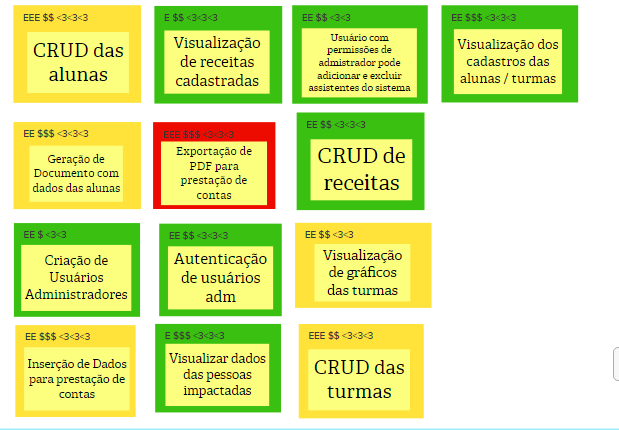

# Revisão Técnica, de Negócio e de UX

Esta revisão tem o objetivo de propor um debate entre a equipe, sobre como esta se sente em relação ao entendimento técnico, o de negócio e o de UX (Experiência de Usuário) de cada funcionalidade. A partir desta atividade, novas notas foram capturadas e as discordâncias e dúvidas ficaram mais aparentes. 

As funcionalizades foram caracterizadas quanto ao nível de confiança e valor de negócio, esforço e UX. O nível de confiança é classificado em cores: verde - fácil; amarelo - médio; e vermelho - difícil. Já os valores de negócio, esforço e UX são classificados em uma escala de 1 a 3 com os símbolos $, E e <3, respectivamente. Essa atividade auxiliou no refinamento de algumas funcionalidades, por isso há uma diferença em relação às da atividade anterior.

O resultado dessa atividade pode ser visto a seguir.

## Versionamento

| Data | Versão | Descrição | Autor(es) |
|------|--------|-----------|-----------|
| 20/11/2022 | 0.1 | Criação do documento | [Gabriela Pivetta](https://github.com/gabrielapivetta) e [Italo Bruno](https://github.com/ItaloBrunoM) |