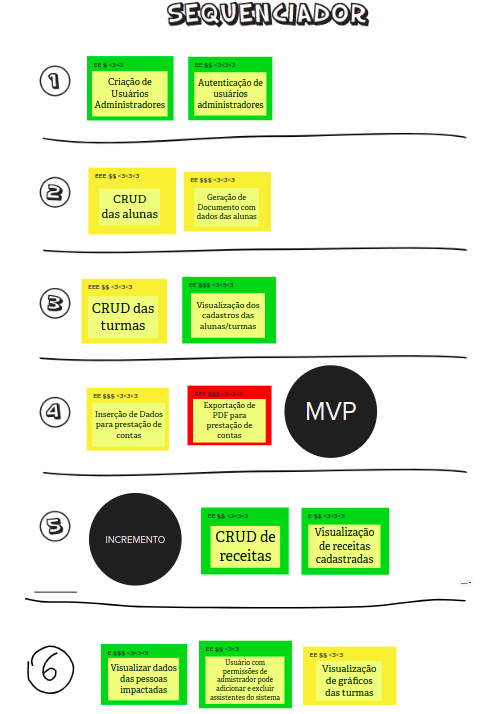

# Sequenciador

O Sequenciador de funcionalidades auxilia na organização e visualização das funcionalidades e da sequência de validação incremental do produto. O objetivo foi definir as 'ondas' do projeto, além de identificar quais funcionalidades fazem parte do MVP e quais pertencerão aos incrementos do projeto. Para que seja seguida a ordem de priorização existem as seguintes regras:

- **Regra 1:** Uma onda pode conter no máximo três cartões.
- **Regra 2:** Uma onda não pode conter mais de uma cartão vermelho.
- **Regra 3:** Uma onda não pode conter três cartões somente amarelos ou vermelhos.
- **Regra 4:** A soma de esforço dos cartões não pode ultrapassar cinco 'E's.
- **Regra 5:** A soma de valor dos cartões não pode ser menos de quatro $s e quatro corações.
- **Regra 6:** Se um cartão depende de outro, esse outro deve estar em alguma onda anterior.

## Versionamento

| Data | Versão | Descrição | Autor(es) |
|------|--------|-----------|-----------|
| 20/11/2022 | 0.1 | Criação do documento | [Gabriela Pivetta](https://github.com/gabrielapivetta) |