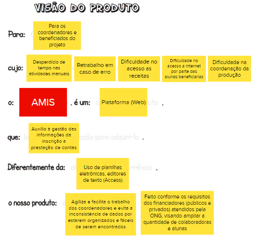

# Visão do Produto

A primeira atividade produzida pelo grupo envolve a Visão do Produto. A visão de um produto mostra quais caminhos e decisões devem ser tomados em relação ao produto a ser desenvolvido. Desta maneira, a equipe foi dividida em 3 grupos, sendo assim solicitado que cada grupo preenchesse as lacunas nos templates. Ao final de tudo foi realizado um debate para compilar as 3 versões em 1, mostrado a seguir:

## Versionamento

| Data | Versão | Descrição | Autor(es) |
|------|--------|-----------|-----------|
| 16/11/2022 | 0.1 | Criação do documento | [Gabriela Pivetta](https://github.com/gabrielapivetta) e [Italo Bruno](https://github.com/ItaloBrunoM) |