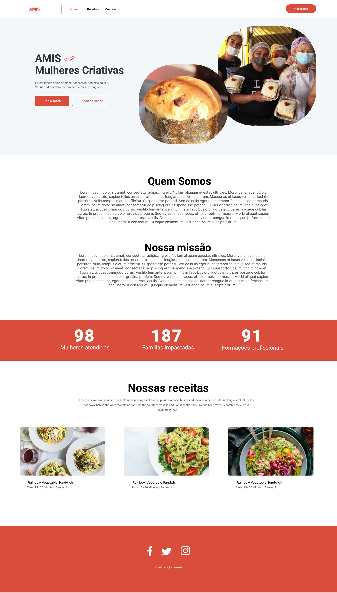
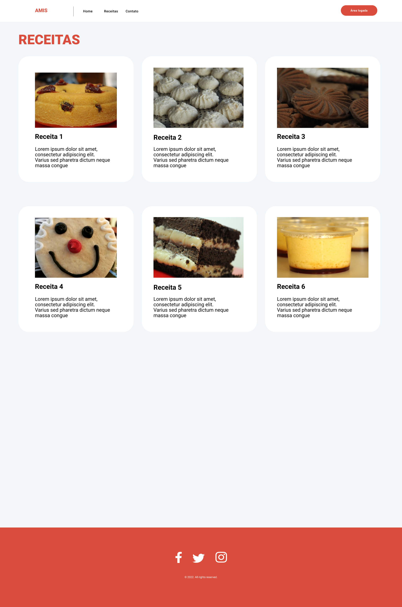
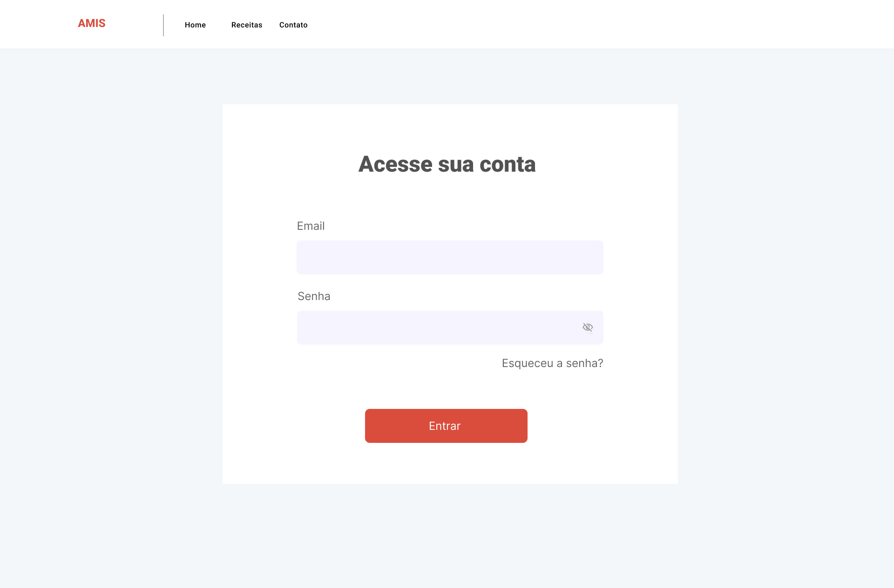
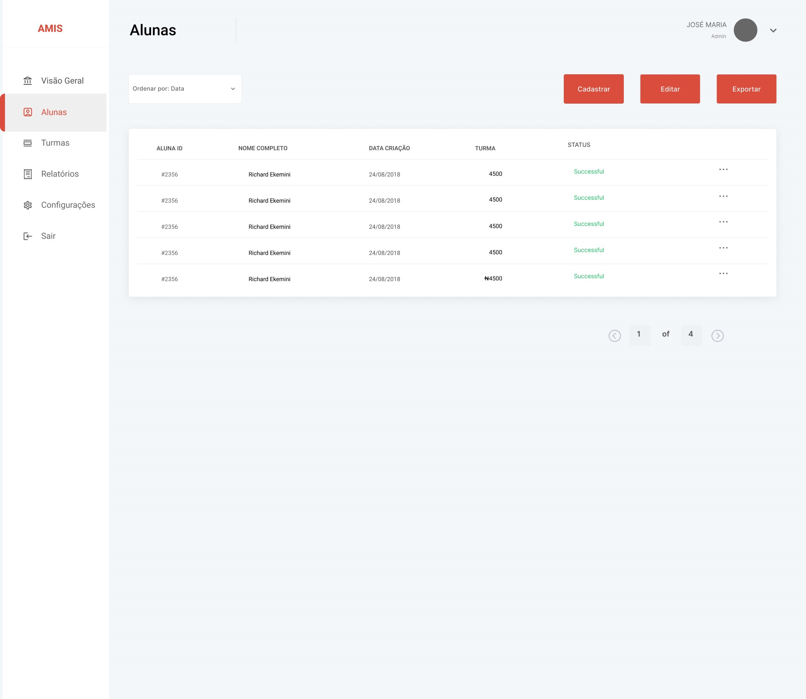
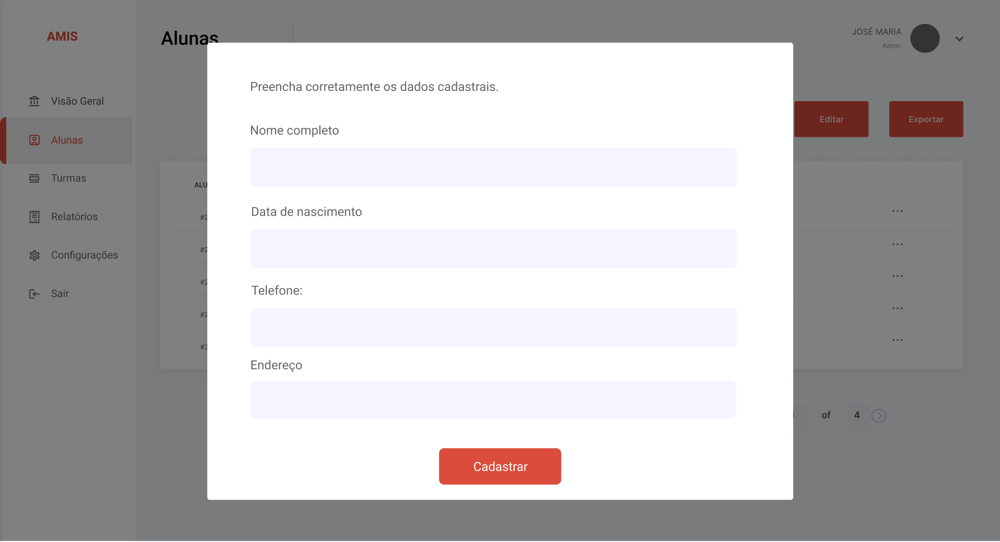
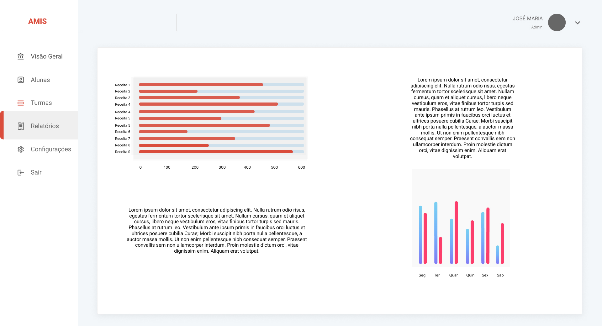
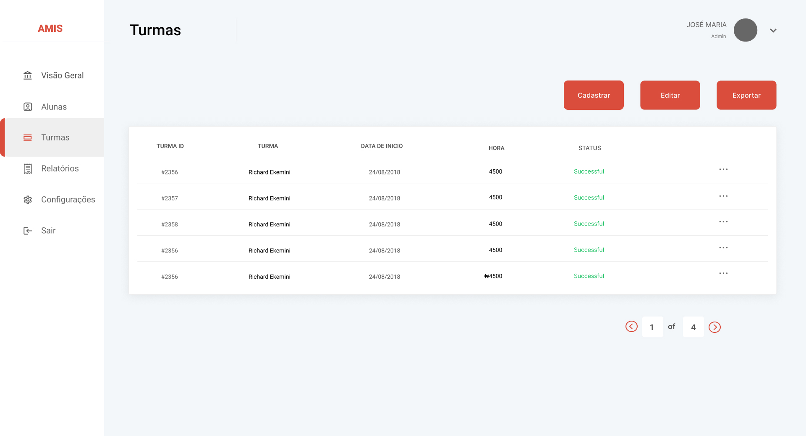

# Protótipo de Alta Fidelidade

Um protótipo de alta fidelidade é uma representação interativa do produto, baseada no computador ou em dispositivos móveis. O protótipo de alta fidelidade para o projeto **AMIS** foi desenvolvido na plataforma *Figma*, o mesmo será apresentado e validado constantemente com o usuário. A seguir estão as telas principais:

## Home

Temos como base a Home do projeto, uma apresentação do projeto AMIS como um todo para quem acessar o sistema.

## Receitas

A seguir temos a página de receitas, onde os usuários poderão ver de maneira simples quais as receitas e como às fazer.

.jpg)

Aqui temos uma ideia de como será a página de uma receita especifica.

## Login + Área do administrador(a)

Aqui é a pagina de login para ter acesso á Área do Adminstrador(a).
A Área de Administrador é onde quem tem acesso pode fazer registro de alunas, turmas, visualizar gráficos do projeto e gerar PDFs para prestação de contas.

## Alunas

Na página de alunas podemos visualizar todas as alunas cadastradas, editar, excluir e adicionar novas alunas.

Cadastro de Alunas

## Relatório

Aqui é uma ideia de como será a página contendo dados em geral.

## Turmas

Por fim, uma breve ideia da página de turmas.

## Versionamento

| Data | Versão | Descrição | Autor(es) |
|------|--------|-----------|-----------|
| 28/11/2022 | 0.1 | Criação do documento e do Protítipo | [André Lucas](https://github.com/andrelucasf) e [Italo Bruno](https://github.com/ItaloBrunoM) |
| 28/11/2022 | 1.0 | Adição de outras paginas criadas no Figma | [André Lucas](https://github.com/andrelucasf), [João Vítor](https://github.com/jvsoutomaior) e [Paulo Borba](https://github.com/paulohborba) |
